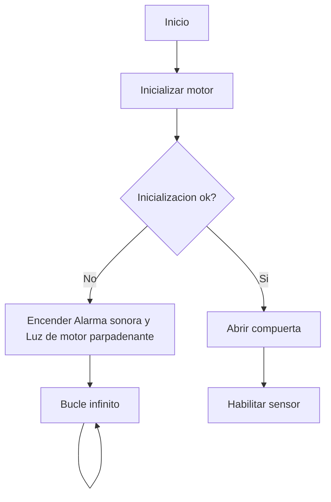
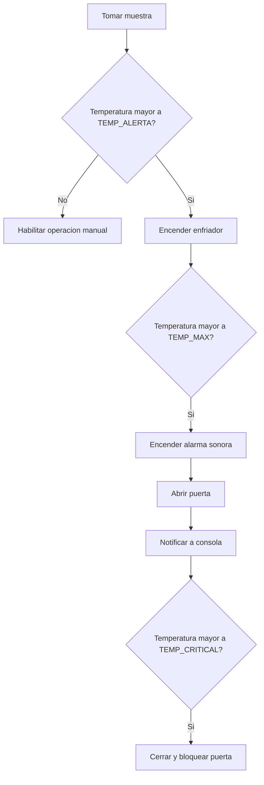
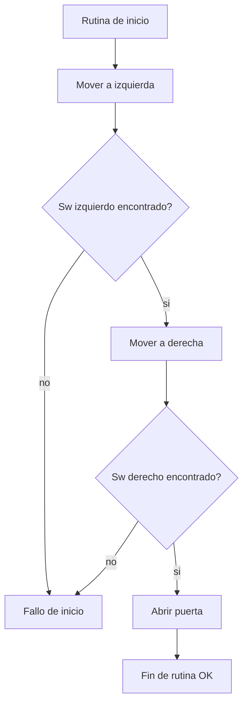

# N-meros-magicos
## Control automático de compuerta y monitoreo del entorno

Este proyecto consiste en el control automático de una compuerta a través de un sensor de temperature, configurable mediante comunicación UART.

El control de la compuerta se realiza por medio de un motor paso a paso a lazo abierto.
El monitoreo del entorno se realiza por medio de un sensor de temperatura
La comunicación por UART permite el control de la compuerta, la configuración del funcionamiento del automatismo y la lectura del historial de temperaturas registradas por el sensor.

El proyecto fue diseñado originalmente para un microcontrolador LPC1769, aunque debió ser migrado durante el desarrollo a STM32F103CB, debido a la falta de disponibilidad del primer micro.

### Escenario
En un depósito de sustancias peligrosas se busca tener el control de una compuerta que permita mantenerla cerrada si la temperatura dentro del depósito es muy alta. En este caso, el automatismo debe accionar los mecanismos para enfriar el ambiente, siendo solo posible abrir la compuerta mediante un comando especial.

En cambio, si la temperatura está dentro del rango normal, la compuerta puede ser operada por medio de un switch local o desde una consola a distancia.

En cualquier caso la consola a distancia puede solicitar el estado de la compuerta y del sensor de temperatura

### Requerimientos

- Al iniciar el automatismo, debe verificar que la compuerta no presente obstáculos y tenga libre movimiento.
- Si la temperatura se encuentra dentro de un rango predefinido, la compuerta puede abrir o cerrarse con un mismo pulsador
- Si la temperatura supera el nivel de alerta, debe encenderse un enfriador,
- Si la temperatura supera el nivel máximo, debe encenderse la alarma sonora
- Si la temperatura supera el nivel crítico, debe cerrarse y bloquear la puerta, impidiendo que pueda abrirse local o remotamente
- Por seguridad, una vez bloqueada la puerta, solo puede volver a abrirse a través de una switch especial.
- Una consola externa debe poder monitorear permanentemente el estado del automatismo y operar la compuerta, excepto cuando la temperatura supere el nivel crítico.

### Diagrama de flujo del automatismo en general

### Diagrama de flujo del sensor de temperatura

### Diagrama de flujo de la rutina de inicio del motor

### Hardware necsario para la implementación

- Placa de desarrollo STM32F103CB
- Motor paso a paso 28BYJ-48 5v
- Driver para motor paso a paso ULN2003
- Sensor de temperatura LM35 (o potenciometro)
- Buzzer pasivo
- 2 Switches para fin de carrera
- 1 Switch para accionamiento manual
- 2 diodos LED
- 2 resistencias 220 ohms
- Módulo conversor serie TTL a USB
- PC con comunicación serie (se provee script menu.py)

### Diagrama de conexionado

### Presentación
[Enlace con la presentación del proyecto](https://www.youtube.com/watch?v=D4o0tx2uYDA)
